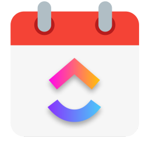

 

ClickUp Timer

A tool for tracking time on ClickUp tasks

Start timers and easily drag & resize events around on a calendar. Changes are synced with ClickUp in real time!

 

## What does it do

* Minimal context switching
* Start/Stop timer
* Intuitive drag & drop UI
* Orderly Week calendar view
* Great overview of gaps in your tracked hours
* Convenient keyboard shortcuts
* Changes synced with ClickUp in real-time
* Lower your cortisol levels at the end of the workday by 30% (results may vary)
* Multilingual (EN, DE, FR, ES) 

## Installation
You can download the latest release for your platform of choice from the [download page](https://anystack.sh/download/clickup-timer); for that, you need to have a license key, which can be obtained by subscribing to the service or purchasing a license directly from the this [page](https://checkout.anystack.sh/clickup-timer). Ensure you enter this key during the installation process to activate the software and gain full access to its features.

### Setup credentials
When starting the app for the first time you are asked to fill in some credentials. You'll need these two:

#### 1. ClickUp Access token
Log in to ClickUp & click on your profile pic in the bottom left. Then click `Apps`.

In the next screen you'll see a button to generate a API token. Do that and paste the output in the ClickUp Timer app's preferences.

#### 2. ClickUp Team ID
You can find your team's ID in the url after you log in to your ClickUp dashboard. It's the first part after the domain. For example if you see `app.clickup.com/1234567`, then your team ID is `1234567`

## Disclaimer
The [ClickUp Timer](https://anystack.sh/download/clickup-timer) app is **unofficial** and therefore not endorsed or affiliated with ClickUp or it's subsidiaries.
